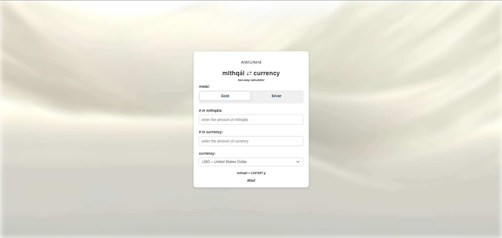

# Mithqál Currency Calculator Static Version

A simplified static version of my other full stack mithqál calculator used to convert (Baháʼí Mithqáls of Gold/Silver<->Currency) applicable to all ISO 4217 certified currencies.
Languages used: HTML, CSS, JavaScript and TypeScript (Removed in Static version).

## Features
- **Two-way conversion:**
  - Convert mithqáls to monetary value.
  - Convert monetary value to mithqáls.
- **Live precious metal pricing:**
  - Fetches real-time gold and silver prices.
- **Live currency conversion rate:**
  - Uses USD as the base currency and supports conversions into all ISO 4217 certified currencies.
- **Custom conversion rate:**
   - Option to use a custom rate in relation to USD.

---

## Project Structure

### Files
1. **`script.js`:** Handles the front-end logic for conversions.
2. **`favicon.ico`:** Website Icon.
3. **`image.png`:** Image of the webpage for the README.
4. **`index.html`:** The main page that holds the calculator process.
5. **`style.css`:** Pure CSS styling for the HTML.
6. **`about.html`:** Explains how the conversion works to users.
7. **`404.html`:** 404 Error page.

---

## Usage Guide

### Performing Calculations
1. **Select Metal Type:**
   - Choose either "Gold" or "Silver" for your needs.
2. **Input Mithqál Value:**
   - Enter the number of mithqáls to convert to money.
   - The corresponding monetary value will be updated accordingly.
3. **Input Money Value:**
   - Enter the amount of money to convert to mithqáls.
   - The equivalent mithqál value will be updated accordingly.
4. **Change Currency:**
   - Select your desired currency from the dropdown list.
   - The monetary value will be updated accordingly.

---

## Notes
1. **API Limits:** The information is accurate so long as the information provided by the APIs are accurate. If this product were to be released you may opt to use a paid API for better reliability and accuracy.
2. **Currency Support:** Currently there is about 40 currencies supported and you can easily add on your desired currency by adding one line in the HTML as the logic is automatically handled by functions.
3. **Repetition:** The logic in the index.html and script.js are basically repeated. I was doing this to learn how they work. However, if you wanted to be perfect and super duper good you could choose to delete the repetition.
